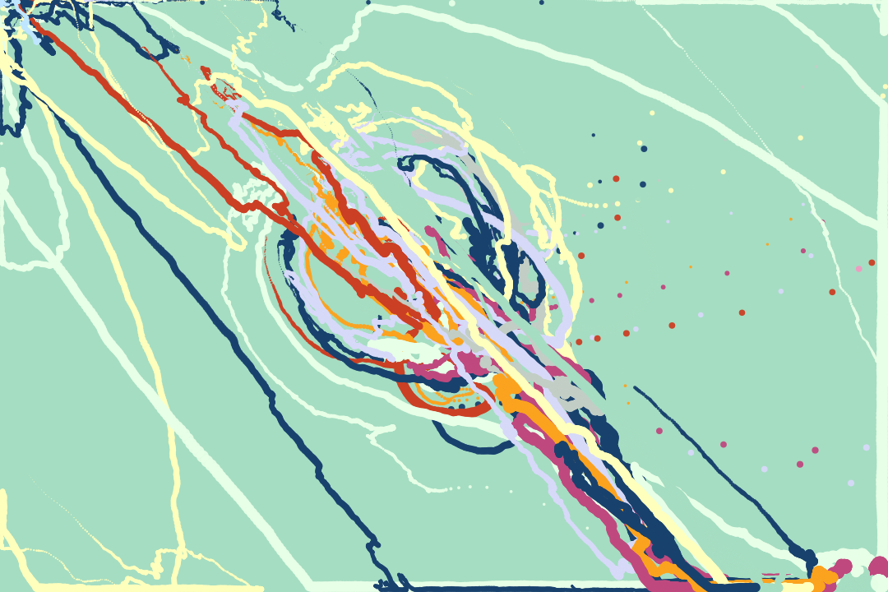
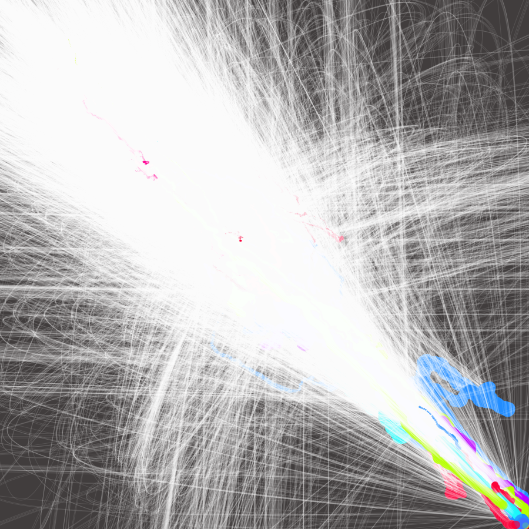

I've been working on my [Twitter art bot @417am1975](https://twitter.com/417am1975) for a little while now.

<blockquote class="twitter-tweet" data-lang="en">
uselinks:true onetarget:true sizeChange:true 39 particles 606-1502767909835 <a href="https://t.co/2P95n07IZv">pic.twitter.com/2P95n07IZv</a>
&mdash; 417am (@417am1975) <a href="https://twitter.com/417am1975/status/897299813074706434">August 15, 2017</a></blockquote>

I started simply. I was curious whether I could make an easy pipeline to sketch generative art ideas using D3 and node-canvas and automatically tweet the results throughout the week.

I was inspired primarily by the work of Anders Hoff / <a href="http://inconvergent.net/generative/">Inconvergent</a>. His essays on generative art helped guide me. His Twitter bots pop up on my feeds occasionally and remind me to go home and try some new generative techniques.

I also love Twitter bots like [Neural TV](https://twitter.com/neural_tv), [@ArtyBots](https://twitter.com/ArtyBots), [@ClipartBot](https://twitter.com/clipartbot), [@SoftLandscapes](https://twitter.com/softlandscapes), [and the like](https://arstechnica.com/information-technology/2017/06/the-art-bots-that-make-twitter-worth-looking-at-again/). 

<blockquote class="twitter-tweet" data-lang="en">
<a href="https://t.co/DqlYiPZSWZ">pic.twitter.com/DqlYiPZSWZ</a>
&mdash; soft landscapes (@softlandscapes) <a href="https://twitter.com/softlandscapes/status/899162887599607808">August 20, 2017</a></blockquote>

Making it as easy as possible to write also came from laying a good groundwork. I used Coffeescript so I could write quickly. I used [Chance.js](http://chancejs.com/) to generate random numbers and boolean (coin-flip) calls. I also use [seeds](https://www.npmjs.com/package/seedrandom) for my random number generators so I can recreate all of the parameters of any piece I like. I just use the timestamp as the seed most of the time.

I started by simply picking a random number of squares to draw, and then randomly generating their X and Y coordinates. 
 <small>101</small>

Then I modified that a bit to give them a random width or height, and pick a random fill color. 

 <small>102</small>

I like circles. So instead of drawing squares, I decided to draw circles. I also wanted to try pulling in random palettes from [ColourLovers](https://www.npmjs.com/package/colourlovers). It basically chooses a random keyword to search on (like "spring" or "blue") and then randomly picks one of the results.
 <small>103</small>

 <small>104</small>

 <small>105</small>

Then I experimented with aligning the circles to the center, and then randomly making them bigger or smaller, and moving them up or down. They overlap and subtly change colors and create some of my favorite effects.

 <small>201</small>

Just the outlines of the circles.

 <small>202</small>

Filling the circles with gradients.

 <small>203</small>

#### Force layout

I also wanted to experiment with using [D3 force](https://github.com/d3/d3-force) layouts for generative art. 

My first experiment was just picking a random color for the particles, and ticking them in the force layout for a bit. 

 <small>601</small>

Then playing around with a hand-selected color palette.

 <small>603</small>

 <small>606</small>

Then drawing links between the particles. 

 <small>607</small>

Or curving the links.

 <small>610</small>

Then I wanted to teach him about words. He's a good visual artist but I think maybe incorporating some generative text would really expand his repertoire. One day I hope to maybe build him a markov bot or something but for now he just selects random bits of poetry I've taught him.

 <small>701</small>

 <small>702</small>

 <small>703</small>

## Next steps

Eventually I want to experiment with trying to "teach" him how to make better art by having favs and retweets encourage him to do more of that sort of thing. I've been looking at [Genetic.js](https://github.com/subprotocol/genetic-js) to potentially use Twitter interactions to evolve different strains of art. If I get this right, hopefully I can leave him alone and he'll learn all on his own (or with the help of his fans, or, at least me). We'll get to that eventually. 

## Favorites

Here are some of my favorite pieces of his:

<blockquote class="twitter-tweet" data-lang="en">
uselinks:true onetarget:true sizeChange:true 39 particles 606-1503143920308 <a href="https://t.co/EZoNFPviZR">pic.twitter.com/EZoNFPviZR</a>
&mdash; 417am (@417am1975) <a href="https://twitter.com/417am1975/status/898876970057908225">August 19, 2017</a></blockquote>

I also experimented with giving him a 10% chance of @'ing another artbot and hashtagging #bot2bot. I've been retweeting my favorite results.

<blockquote class="twitter-tweet" data-lang="en">
: hi <a href="https://t.co/xq2BVILddQ">pic.twitter.com/xq2BVILddQ</a>
&mdash; Pixel Sorter (@pixelsorter) <a href="https://twitter.com/pixelsorter/status/897283392416301057">August 15, 2017</a></blockquote>

<blockquote class="twitter-tweet" data-lang="en">
.<a href="https://twitter.com/417am1975">@417am1975</a> You have the prettiest radiis. <a href="https://t.co/wZumulWeos">pic.twitter.com/wZumulWeos</a>
&mdash; Arty Polar (@ArtyPolar) <a href="https://twitter.com/ArtyPolar/status/896940618030731264">August 14, 2017</a></blockquote>

I also really like this guy who occasionally names some of his creations. 

<blockquote class="twitter-tweet" data-lang="en">
bear over sunrise <a href="https://t.co/VQ6OdEQmdM">https://t.co/VQ6OdEQmdM</a>
&mdash; Data Man (@igokaskowitz) <a href="https://twitter.com/igokaskowitz/status/896053243372949504">August 11, 2017</a></blockquote>

### Useful tools

+ Chance.js <http://chancejs.com/>
+ Simplex Noise NPM package <https://www.npmjs.com/package/simplex-noise>
+ SeedRandom NPM package <https://www.npmjs.com/package/seedrandom>
+ 