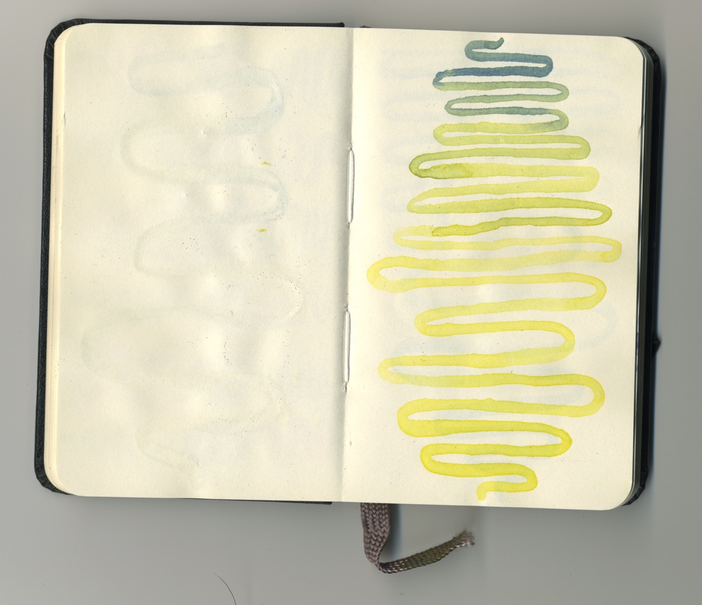
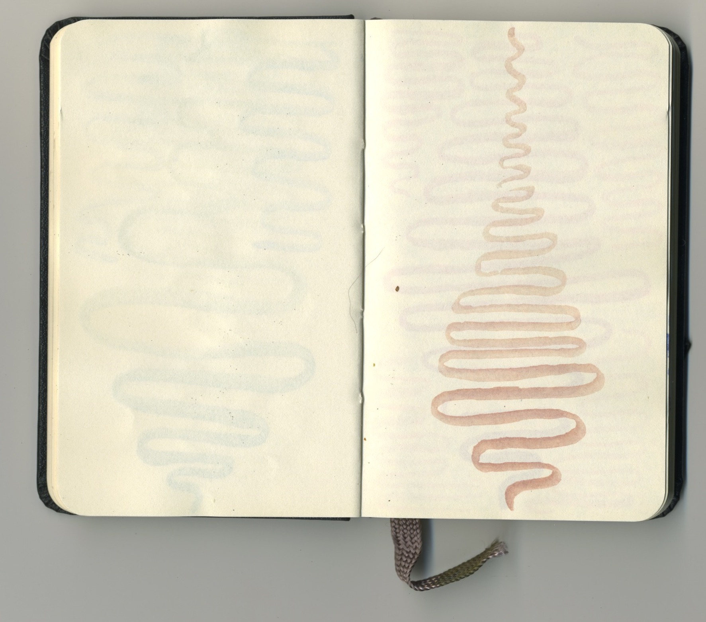
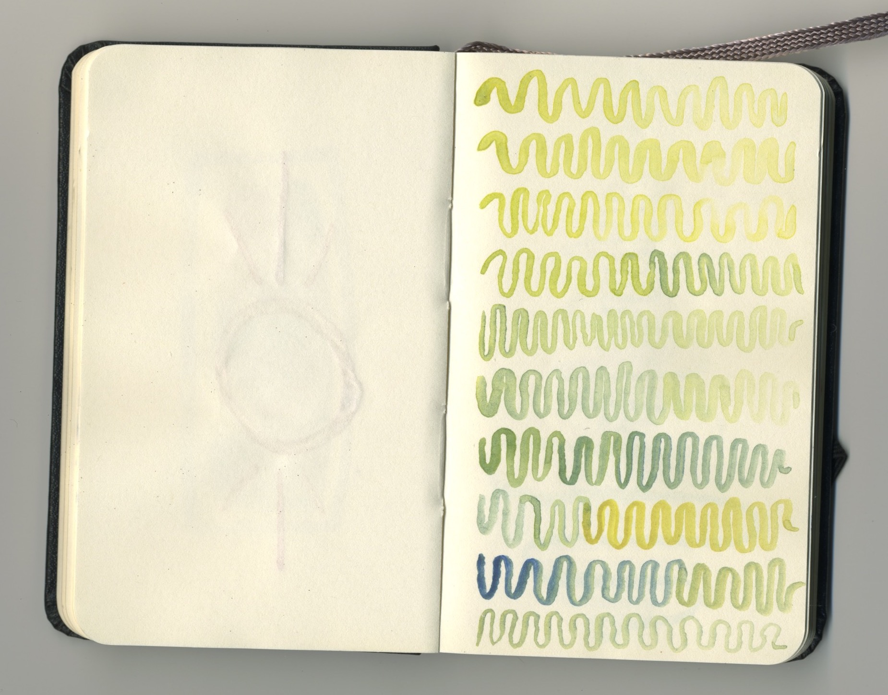
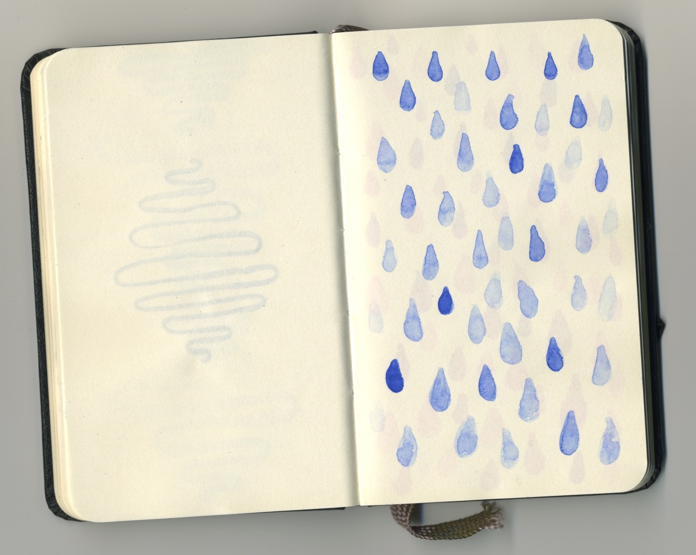
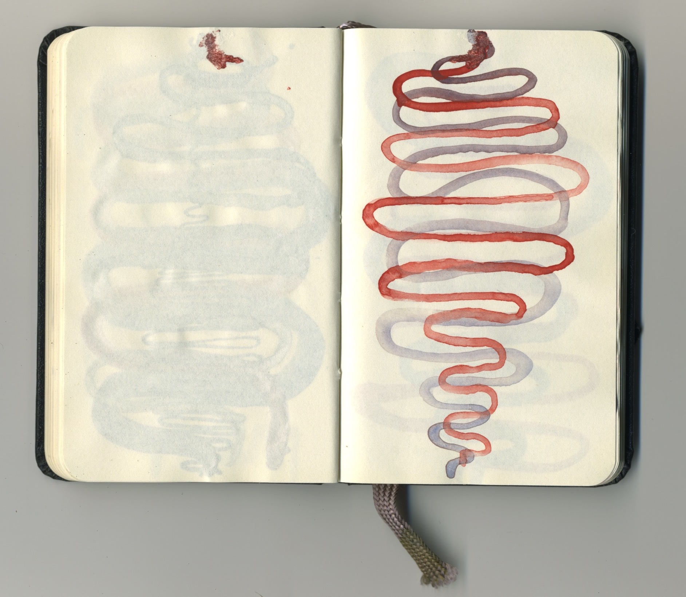

As I've been experimenting with my <a href="https://blog.ejfox.com/articles/artbot/">Twitter art bot</a> I've also been sketching regularly using watercolors in a tiny little notebook. 

I tried to just use it as a meditative exercise to let my mind calm down. But I also wanted to do some studies in watercolor that I could later use as inspiration for new generative art sketches.

The unique behavior and look of watercolors has always interested me. There is a style and handmade feel you rarely get on the computer, with a few <a href="http://maps.stamen.com/watercolor/#12/40.7111/-73.9294">rare exceptions</a>. Luckily Stamen has some <a href="https://hi.stamen.com/watercolor-process-3dd5135861fe">great</a> <a href="https://hi.stamen.com/watercolor-textures-15de97a4ad8b">posts</a> that I'm looking forward to digging into.

## Favorites

I like the way the two layers of watercolor blend together here, as well as the smoothness of the wavy line. I think my tendency in some of the generative art sketches is to put a lot of things on the page. I think experimenting with subtle changes on a few simple elements will yield interesting results. 

Experimenting with crossing a wavy line through circles. I love the way the line darkens when it crosses the red paint in the top 4 circles, and the wishy-washiness of the red paint in the center circle. 

An experiment in blending paint on a very wet page. The ways the paint does and does not blend together is something that I'd like to look into trying to replicate or mimic. 

I need to find a way to capture the way that a watercolor line looks in my generative art. The paint trails off unevenly, and occasionally when I dip for more ink and it comes back darker. 

I really like the way the lines fade from dark to light here. I also like the way the line breaks but doesn't lose momentum. Another thing I want to look into imitating to give my generative art a more hand-done feel.

## The complete notebook

